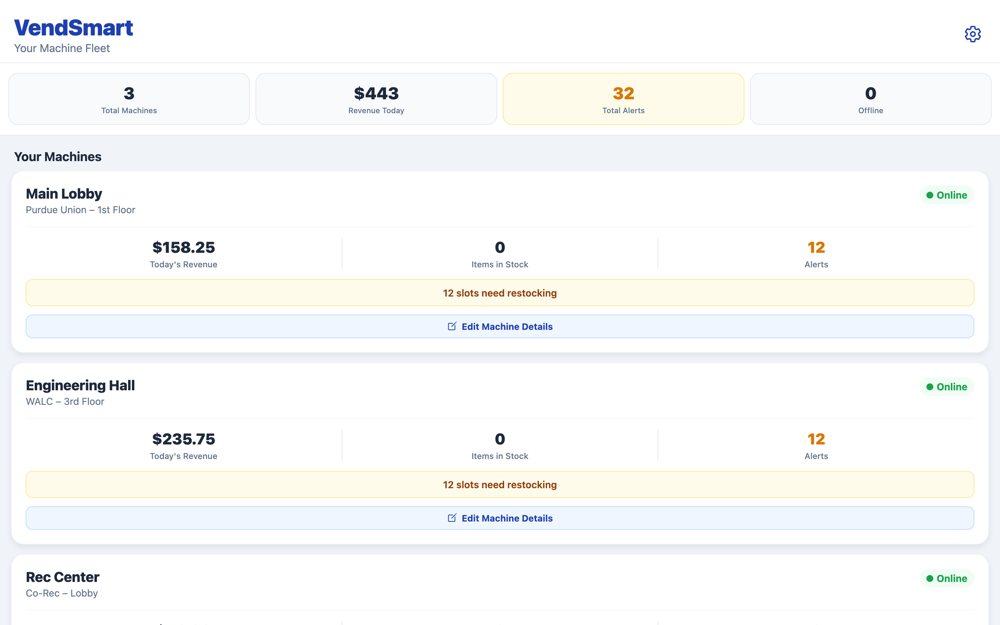

# VendSmart

Fleet monitoring for vending machine operators. Operators retrofit existing machines with a
low-cost sensor kit instead of replacing them, and manage the whole fleet from one app.

**[Live demo](https://epravato.github.io/Smart-vend-app/)** — there is a one-click demo account
on the login screen, no signup needed.



## The problem

A connected vending machine costs $10,000 and up. Most operators are running machines that work
fine and have no intention of replacing them, so they drive a route blind, restocking machines
that did not need it and missing the ones that ran dry.

VendSmart is a roughly $1,500 retrofit (Arduino plus IR sensors) that reports stock and sales
from a machine the operator already owns. Our model projects 15 to 25% fewer service trips.

## What it does

- Fleet overview with per-machine revenue, stock level and alert count
- Restocking alerts down to the individual slot
- Per-machine detail and editing
- A separate courier PIN flow, so route drivers get a restocking view without an operator login

## Stack

React Native and Expo, deployed to the web via Expo's web build. Firebase (Firestore) for data.
React Navigation for routing. `react-native-chart-kit` for the charts.

```
src/
  app-routing/      navigation
  context/          app state
  fake-data/        seed data for the demo account
  firebase/         Firestore config and queries
  screens/          every screen
  shared-ui-pieces/ reusable components
docs/               the built web bundle GitHub Pages serves
```

## Status

Working prototype. The demo account runs on seeded data so the app can be evaluated without
hardware. The hardware retrofit kit is built by my co-founder and is a separate effort.

## Running it

```bash
npm install
npx expo start        # then press w for web, or scan the QR code with Expo Go
```

## Note on the Firebase key

The Firebase web API key in this repo is a public client identifier, not a secret. Firebase is
designed this way. Access control lives in the Firestore security rules, not in the key.
